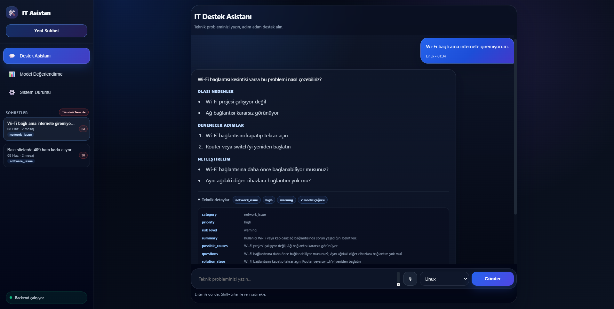
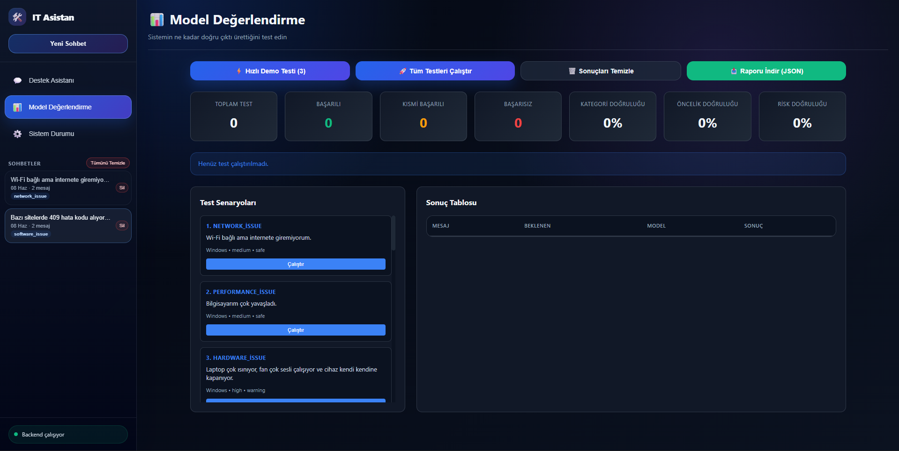
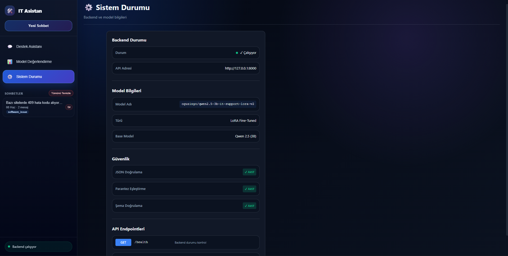

# Fine-Tuned IT Support Agent

Bu proje, kullanıcıların teknik problemlerini fine-tune edilmiş bir model ile analiz eden IT destek asistanıdır. Backend modeli çağırır, JSON çıktısını doğrular, frontend ise sonucu sohbet arayüzünde gösterir.

## Özellikler

- Fine-tuned model entegrasyonu
- Model-only backend mimarisi
- JSON parse ve validation
- Windows/macOS/Linux/Unknown OS seçimi
- Chat arayüzü ve sohbet geçmişi
- Teknik detaylar alanı
- Evaluation dashboard

## Ekran Görüntüleri

Destek asistanı:



Model değerlendirme:



Sistem durumu:



## Model-Only Mimari

- Backend hazır cevap üretmez.
- Mock/template/fallback/policy response yoktur.
- Başarılı cevaplar fine-tuned modelden gelir.
- Model geçersiz JSON üretirse retry yapılır.
- Retry başarısız olursa `502` dönebilir.
- Cevap kalitesi dataset/fine-tune kalitesine bağlıdır.

## Kullanılan Model

```ini
FINE_TUNED_MODEL_NAME=oguzinyo/qwen2.5-3b-it-support-lora-v2
```

## JSON Response Formatı

Model cevabında beklenen alanlar:

- `category`
- `priority`
- `summary`
- `possible_causes`
- `questions`
- `solution_steps`
- `risk_level`
- `assistant_message` opsiyonel

`assistant_message` sadece frontend'de daha doğal gösterim içindir; ana zorunlu alanların yerine geçmez.

## Proje Yapısı

```text
backend/
frontend/
dataset/
docs/
tests/
README.md
LICENSE
.gitignore
```

## Kurulum

```powershell
cd backend
pip install -r requirements.txt
```

## Backend Çalıştırma

```powershell
$env:KMP_DUPLICATE_LIB_OK="TRUE"
python -m uvicorn app.main:app --port 8000
```

Özel conda environment örneği:

```powershell
& "C:\Users\MSI\anaconda3\envs\it-support-agent\python.exe" -m uvicorn app.main:app --port 8000
```

Health:

```text
http://127.0.0.1:8000/health
```

## Frontend Çalıştırma

`frontend/index.html` tarayıcıda açılabilir.

Backend static servis ediyorsa:

```text
http://127.0.0.1:8000
```

## API Örneği

```http
POST /analyze
```

Request:

```json
{
  "message": "Wi-Fi bağlı ama internete giremiyorum.",
  "os": "Windows",
  "session_id": "optional"
}
```

## Test Komutları

```powershell
python -m pytest backend\tests
node --check frontend\app.js
```

## Bilinen Sınırlılıklar

- Local model olduğu için cevap süresi değişebilir ve yavaş olabilir.
- Model bazen bozuk Türkçe veya yetersiz cevap üretebilir.
- Backend model cevabını hazır cevapla düzeltmez.
- Daha iyi sonuç için dataset iyileştirilip model yeniden fine-tune edilmelidir.

## GitHub'a Eklenmemesi Gerekenler

- `.env`
- `sessions.json`
- `__pycache__`
- `node_modules`
- model cache
- `*.safetensors`
- `*.bin`
